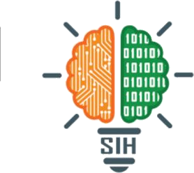
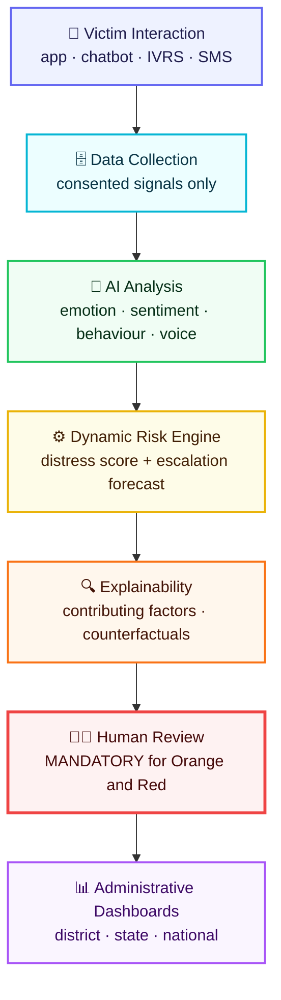

<p align="center">
  
</p>

<h1 align="center">🪷 SAHAAYA</h1>

<p align="center">
  <b>AI-Assisted Mental Health Monitoring &amp; Distress Prediction for Victims of Atrocities</b><br>
  <sub>Smart India Hackathon 2026 · Problem Statement <b>26094</b></sub>
</p>

<p align="center">
  <a href="https://sih-sahaaya.vercel.app"></a>
  <a href="https://sahaaya-ten.vercel.app/health"></a>
</p>

<p align="center">
  
  
  
  
  
  
  
  
  
</p>

---

> [!WARNING]
> **Prototype — synthetic data only.** Every record in this repository is machine-generated and carries the label `[PROTOTYPE DATA - NOT REAL VICTIM DATA]`. **No real victim data is used anywhere.** SAHAAYA does not diagnose, prescribe, or trigger any intervention on its own — a trained human reviews every serious alert.

---

## 🎯 The Problem

Victims of atrocities often experience prolonged psychological distress long after a complaint is registered — from threats and intimidation, repeated court appearances, stalled investigations, social isolation, financial hardship, and delays in compensation and rehabilitation.

**That deterioration is usually invisible until a crisis happens.**

> **How can authorities continuously identify worsening psychological distress and provide timely support *before* the situation becomes critical?**

---

## 💡 The Solution

SAHAAYA turns scattered, low-friction signals into one continuously-updated **Dynamic Distress Score (0–100)** — then explains it, predicts escalation, and routes it to a human being.

<table>
<tr>
<td width="33%" valign="top">

### 🫂 For the survivor
A calm, multilingual space. Mood check-ins, a supportive chatbot, and a one-tap support request. **Never shown a risk number or a band** — no one should be told they are a "74".

</td>
<td width="33%" valign="top">

### 👩‍⚕️ For the counsellor
Explainable alerts, not black boxes. Every score arrives with its contributing factors, a case timeline, a distress trend, and recommended actions to accept, monitor, or dismiss.

</td>
<td width="33%" valign="top">

### 🏛️ For the administration
District → State → National rollups. Where distress is concentrating, which cases are escalating, and what interventions actually moved the needle.

</td>
</tr>
</table>

---

## 🧮 The Dynamic Distress Score

Six weighted signals, combined against each person's **own personal baseline** — not a population average, because "normal" is different for everyone.

| Signal | Weight | What it reads |
|:---|:---:|:---|
| 📝 **Self-reported well-being** | `35%` | Mood, anxiety, sleep, safety, hopelessness, isolation |
| 💬 **Text emotion & sentiment** | `20%` | Fear, anger, hopelessness and threat language in chat |
| 📉 **Behavioural pattern change** | `15%` | Missed check-ins, cancelled counselling, disengagement |
| 🎙️ **Voice indicators** | `10%` | Pitch variability, energy, speaking rate *(supporting signal only)* |
| ⚖️ **Case & external events** | `10%` | Threats, hearings, bail, compensation delays — recency-decayed |
| 📈 **Longitudinal trend** | `10%` | Direction and slope of the last 8 weeks |

### Bands

| | Band | Range | Meaning |
|:---:|:---|:---:|:---|
| 🟢 | **Green** | `0–29` | Stable |
| 🟡 | **Yellow** | `30–49` | Mild / emerging concern |
| 🟠 | **Orange** | `50–74` | Significant — follow-up recommended |
| 🔴 | **Red** | `75–100` | **Urgent — human review required** |

> [!NOTE]
> Thresholds are configurable and would need validation by qualified domain experts before any real-world use.

---

## 🏗️ Architecture



**The red box is the point.** No alert becomes an action without a person deciding.

---

## 📊 Current Demo Dataset

Twelve synthetic cases, deliberately kept small and hand-checkable. Each is generated from a distinct **risk profile** that steers their *inputs* — how they report, what they write, whether they engage, how their case is going. The scores below are then computed by the real engine from those inputs; **nothing writes a score directly.**

| | Band | Cases | Score range |
|:---:|:---|:---:|:---|
| 🟢 | Green | **4** | 9.3 – 25.1 |
| 🟡 | Yellow | **3** | 39.9 – 44.9 |
| 🟠 | Orange | **3** | 65.5 – 74.3 |
| 🔴 | Red | **2** | 89.0 – 98.9 |

`12 victims` · `3 states` · `6 districts` · `8 active alerts` · `41.7% high-risk`

Regenerate the dataset (seeded, so it is reproducible):

```bash
cd sahaaya/services/nlp-ai-service && python synthetic_data_generator.py
```

---

## 🛠️ Tech Stack

| Layer | Technology |
|:---|:---|
| 🌐 **Web** | Next.js 14 (App Router) · TypeScript · Tailwind CSS · Framer Motion · Recharts · Zustand |
| 📱 **Mobile** | Flutter · fl_chart · custom-painted distress gauges |
| ⚡ **Backend** | Python 3.11 · FastAPI · Pydantic · Uvicorn |
| 🤖 **AI / ML** | scikit-learn · XGBoost · TF-IDF emotion classifier · pandas · NumPy |
| 🔍 **Explainability** | Feature attribution · rule-based narratives · counterfactuals |
| 🚀 **Deploy** | Vercel (web + demo API) · Docker + Render (live inference) |

---

## 📂 Repository Structure

```
SAHAAYA-SIH/
├── 1_PDR.md                        # Product Design Requirements
├── 2_Design_Document.md            # Design system & UX
├── 3_Tech_Stack.md                 # Architecture decisions
├── SIH_DEMO_GUIDE.md               # How to run the demo
└── sahaaya/
    ├── api/                        # Vercel serverless demo API + snapshot.json
    ├── apps/
    │   ├── web/                    # Next.js — landing, officer console, victim portal
    │   └── mobile/                 # Flutter victim app
    ├── services/
    │   ├── api-gateway/            # FastAPI backend (port 8000)
    │   ├── distress-engine/        # Dynamic Distress Score engine
    │   ├── explainability-service/ # Factor attribution & narratives
    │   ├── human-review-service/   # Alerts, review decisions, interventions
    │   └── nlp-ai-service/         # Emotion model + synthetic data generator
    ├── scripts/build_snapshot.py   # Captures real engine output for the demo API
    └── infra/                      # Docker, nginx, database schema
```

---

## 🚀 Quick Start

<details open>
<summary><b>▶️ Run it locally</b></summary>

**Prerequisites:** Python 3.11+, Node.js 20+

```bash
git clone https://github.com/achinth52200/SAHAAYA-SIH.git
cd SAHAAYA-SIH/sahaaya
```

**1 · Backend** → http://localhost:8000 (docs at `/docs`)

```bash
pip install -r requirements.txt
cd services/api-gateway && python main.py
```

**2 · Web** → http://localhost:3000

```bash
cd apps/web
npm install
npm run dev
```

</details>

<details>
<summary><b>🐳 Run the full stack with Docker</b></summary>

```bash
cd sahaaya
cp .env.example .env      # edit values
docker-compose up -d --build
```

Starts PostgreSQL `:5432`, Redis `:6379`, and the API gateway `:8000`.

</details>

---

## 🔑 Demo Accounts

Password for all accounts: **`demo123`**

| Role | Email | Lands on |
|:---|:---|:---|
| 👮 District Officer | `district@sahaaya.gov.in` | Officer console |
| 🏛️ State Officer | `state@sahaaya.gov.in` | State dashboard |
| 🇮🇳 National Admin | `national@sahaaya.gov.in` | National dashboard |
| 👩‍⚕️ Counsellor | `counsellor@sahaaya.gov.in` | Alert queue |
| 🫂 Survivor | `victim@sahaaya.gov.in` | Victim portal |

> `victim1@` … `victim12@sahaaya.gov.in` open the other synthetic cases.

---

## 🔒 Privacy &amp; Ethics

These are constraints on the build, not aspirations.

- ✅ **Explicit, reviewable consent** before any data collection
- ✅ **Role-based access control** — Victim / Counsellor / District / State / National
- ✅ **Encryption in transit and at rest**, token auth, audit logging, data minimisation
- ✅ **No real victim data** — synthetic only, and labelled as such in every record
- ✅ **Mandatory human review** for every Orange and Red state
- ✅ **Voice is a supporting signal only** — never decisive, given known accent and language bias
- ❌ **The AI never diagnoses, prescribes, or makes an irreversible decision**

---

## ⚠️ Known Risks &amp; Mitigations

| Risk | Mitigation |
|:---|:---|
| False positives | Human review required before any serious intervention |
| False negatives | Multiple independent signals + a direct one-tap support request |
| Voice AI bias | Supporting signal only; fairness testing across languages and accents |
| AI displacing professionals | Positioned strictly as early-warning decision support |
| Sensitive data exposure | Consent, encryption, RBAC, audit logging |
| Loss of survivor trust | Transparent communication about what is collected and why |

---

## 🌐 Deployment

| Environment | URL | Notes |
|:---|:---|:---|
| 🖥️ Web | [sih-sahaaya.vercel.app](https://sih-sahaaya.vercel.app) | Next.js on Vercel |
| ⚡ Demo API | [sahaaya-ten.vercel.app](https://sahaaya-ten.vercel.app) | Serves a captured snapshot of **real engine output** |
| 🐳 Live inference | `render.yaml` / `Dockerfile.api` | Full stack, live scoring |

<details>
<summary><b>Why the demo API serves a snapshot</b></summary>

The full ML stack (scikit-learn, pandas, scipy, and XGBoost — required because the saved classifier is an `XGBClassifier`) bundles to **~618 MB** against Vercel's hard **500 MB** function limit.

Rather than fabricate numbers to fit, `scripts/build_snapshot.py` boots the **real** API gateway in-process, exercises every route, and records the responses verbatim. Every value the demo API serves is genuine engine output. The Docker/Render configuration runs the identical code with live inference.

</details>

---

<p align="center">
  <sub>Built for <b>Smart India Hackathon 2026</b> · Problem Statement 26094</sub><br>
  <sub>🪷 Prototype. Synthetic data. Human in the loop, always.</sub>
</p>
